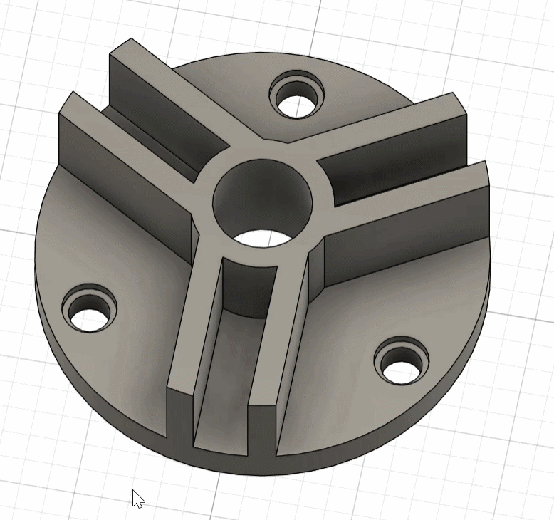
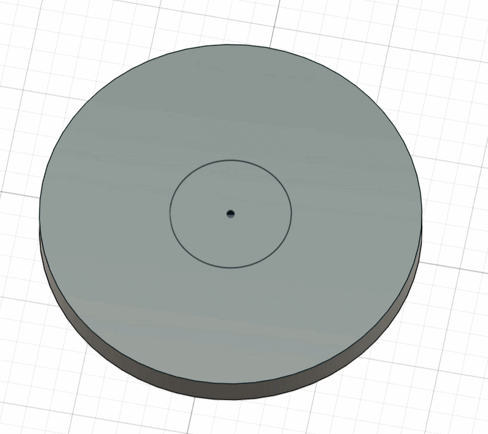
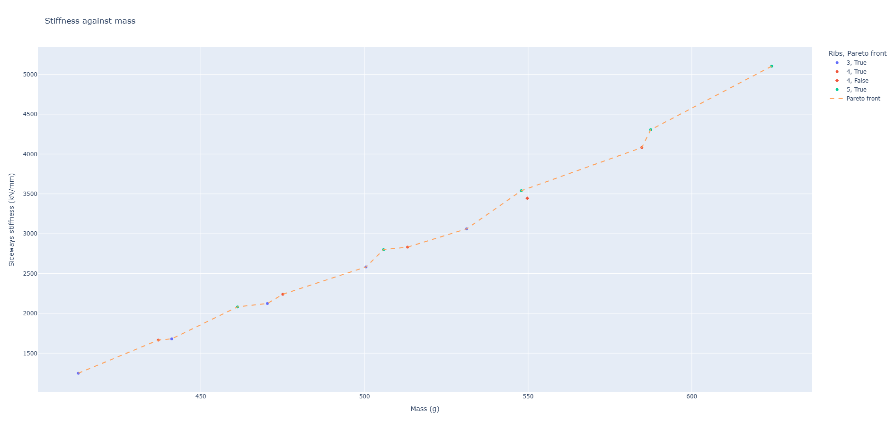
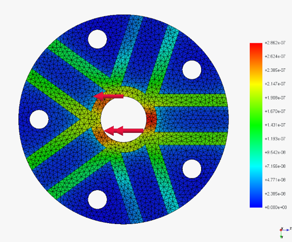
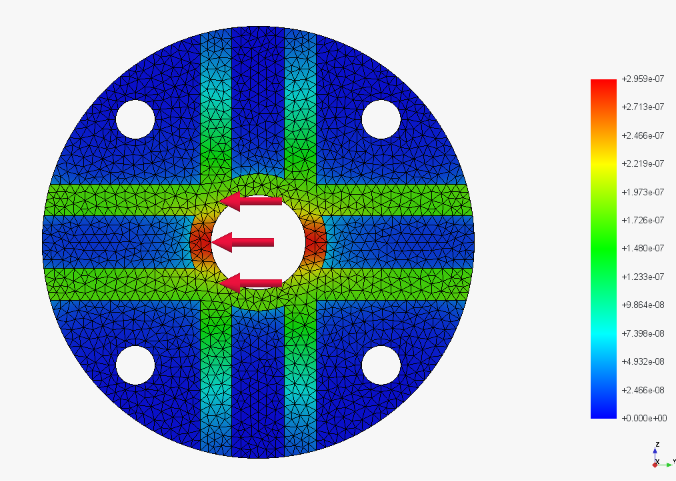

# Parametric Rib Study: Automated Design Exploration in Fusion 360

<p align="center">
  
</p>
<p align="center"><em>All 15 variants generated automatically by the Python script.</em></p>

A small generative design pipeline. A parametric mounting hub is driven from Python through the Fusion 360 API, 15 design variants are generated automatically, each is checked for buildability, and each is evaluated for mass and sideways stiffness. A quick stiffness estimate is then checked against finite element analysis in FreeCAD.

## The question

The part is a hub bolted down through its base, with a shaft through the central bore. When the shaft is pushed sideways, the ribs stop the hub from bending over.

**For a given mass, how should the ribs be arranged to make the hub as stiff as possible? Fewer thick ribs, or more thin ones?**

## Pipeline

1. **Parametric model (Fusion 360).** Every key dimension is a named User Parameter, so changing one value rebuilds the whole part.
2. **Variant generation (Python, Fusion API).** A script loops through every combination of rib count and wall thickness, rebuilds the model, checks every feature rebuilt successfully, and records mass, volume and surface area to CSV.
3. **Buildability check (Python).** Each design is checked for enough material between the bolt counterbores and the rib walls.
4. **Stiffness estimate (Python).** Each rib wall is treated as a cantilever beam, with its contribution weighted by its orientation to the load.
5. **Trade off analysis (pandas, Plotly).** Stiffness is plotted against mass, and the Pareto front is identified among buildable designs.
6. **FEA validation (FreeCAD, CalculiX).** Two designs of near identical mass are simulated to test the estimate.

## The parametric model

The base geometry follows a Fusion 360 tutorial part. The work in this project is in making it robustly parametric and building the study around it.

The tutorial version could not change its rib count, because the ribs were drawn and trimmed as sketch lines. I rebuilt it so that a single rib is a solid feature, and the slots and bolt holes are patterned features, all driven by `rib_count`. The bolt holes are positioned at an angle of `180 deg / rib_count`, so they stay centred between the ribs for any rib count.

<p align="center">
  
</p>
<p align="center"><em>The model built step by step: base, hub, one rib, then patterned slots and holes driven by rib_count.</em></p>

| Parameter | Baseline | Role |
|---|---|---|
| `rib_count` | 3 | Number of ribs, slots and bolt holes |
| `rib_thickness` | 5 mm | Thickness of each rib wall |
| `slot_width` | 10 mm | Gap between the two walls of a rib |
| `rib_height` | 20 mm | Height of ribs and hub above the base |
| `base_diameter` | 82 mm | Outer diameter of the base |
| `hub_diameter` | 26 mm | Diameter of the central hub |
| `hole_radius` | 33 mm | Distance from the centre to each bolt hole |

Rib width is `slot_width + 2 * rib_thickness`, and the slot depth is linked to `rib_height`.

<p align="center">
  
</p>
<p align="center"><em>The baseline design: 3 ribs, 5 mm walls.</em></p>

Fillets and chamfers were excluded from the study. Their edges change with rib count (with three ribs a thin strip of hub separates adjacent walls, with four or more the walls meet directly), so they cannot follow the pattern reliably. Their effect on mass is negligible.

## Design constraints

The first version of the study used a 62 mm base with holes 21.55 mm from the centre. Checking the results showed that 7 of the 15 designs could not be built: with more or thicker ribs, the counterbores cut into the rib walls.

I added a buildability rule, requiring at least 2 mm of material between each counterbore and the nearest rib wall:

```
clearance = hole_radius × sin(180° / rib_count) − (slot_width / 2 + rib_thickness) − counterbore_radius
```

I then enlarged the base to 82 mm and moved the holes out to 33 mm, so that every design in the study passes. The tightest case, 5 ribs with 7 mm walls, has 2.4 mm of clearance. The check stays in the analysis, so any future change to the ranges is caught automatically.

## Variant study

15 variants: `rib_count` of 3, 4 and 5, and `rib_thickness` of 3 to 7 mm. All 15 rebuilt without errors and all 15 are buildable. Masses range from 412 g to 624 g (steel).

<p align="center">
  
</p>

Mass rises linearly with wall thickness. Each extra rib adds less mass than the one before (at 7 mm, going from 3 to 4 ribs adds about 54 g, but 4 to 5 adds about 39 g), because ribs overlap more near the hub as they crowd together, and overlapping material only counts once.

<p align="center">
  
</p>

Each dot is one generated design, positioned by its rib count, wall thickness and mass.

## Stiffness against mass

<p align="center">
  
</p>

Fourteen of the fifteen designs sit on the Pareto front, meaning no other design is both lighter and stiffer. The one exception is **4 ribs at 6 mm**, which is beaten by **5 ribs at 5 mm**: 1.8 g lighter and, on the estimate, about 3% stiffer. This is the one clear claim the estimate makes, so it is the one I tested with FEA.

## FEA validation

Both designs were simulated in FreeCAD with CalculiX under identical conditions: base fixed, 1000 N applied sideways across the bore wall, steel, 2 mm mesh.

| Design | Mass | Estimated stiffness | FEA stiffness | Estimate error | FEA max stress |
|---|---|---|---|---|---|
| 5 ribs, 5 mm | 547.9 g | 3,539 kN/mm | 3,493 kN/mm | +1.3% | 3.31 MPa |
| 4 ribs, 6 mm | 549.8 g | 3,444 kN/mm | 3,379 kN/mm | +1.9% | 3.30 MPa |

<p align="center">
  
  
</p>
<p align="center"><em>Displacement under a 1000 N sideways load, on the same colour scale. Left: 5 ribs, 5 mm. Right: 4 ribs, 6 mm.</em></p>

## Findings

1. **More, thinner ribs give more stiffness per gram.** FEA confirms the 5 rib, 5 mm design is 3.4% stiffer than the 4 rib, 6 mm design while being slightly lighter, matching the estimate's ranking.
2. **The beam estimate was accurate to within 2%** for this geometry, which makes it a reliable way to screen many variants quickly.
3. **Peak stress is almost identical and very low** (about 3.3 MPa at 1000 N), so strength does not govern this design. Stiffness per gram does.
4. **Buildability changed the design.** A third of the original variants could not be manufactured, which forced a larger base and a wider hole pattern.

## Lessons

- **Check buildability, not just performance.** The original study looked complete until the geometry was checked for clashes. Adding the rule turned it into a real design constraint rather than an afterthought.
- **How the load is applied can matter more than the model.** My first simulations applied the force to the rim edge of the bore rather than its wall. That concentrated the load on a line and produced displacements around six times too large and stresses around thirty times too high, which made the estimate look 20 to 30% wrong. Applying the load correctly brought the error under 2%.

## Limitations

- **The estimate's accuracy may be partly coincidental.** It ignores shear, which makes it too stiff, and ignores how the hub and base support the ribs, which makes it too soft. These may partly cancel for this geometry, so it should be rechecked before trusting it for very different proportions.
- **Only two designs were simulated.** The FEA checks the key ranking, not the whole design space.
- **Maximum stress is approximate**, because sharp internal corners (fillets excluded) make it mesh dependent.

## Next steps

- Automate the FEA through FreeCAD's Python API, so every variant gets simulated stiffness rather than an estimate.
- Train a surrogate model on the simulated results to predict stiffness from the parameters.
- Add further parameters, such as rib height or hole position, to explore a larger design space.

## Files

```
variant_test.py                        Fusion script: change rib_count and read mass
variant_study.py                       Fusion script: generate all 15 variants to CSV
plot_results.py                        Mass charts
add_stiffness.py                       Buildability check, stiffness estimate, Pareto front
fea_validation.py                      Compares the estimate with FEA
variant_results.csv                    Raw results from Fusion
variant_results_with_stiffness.csv     Results with stiffness and buildability
fea_validation.csv                     Estimate against FEA
ribs5_t5.step, ribs5_t5.FCStd          FEA model, 5 ribs 5 mm
ribs4_t6.step, ribs4_t6.FCStd          FEA model, 4 ribs 6 mm
images/                                Charts, screenshots and animations
```

## How to run

1. **Variant study:** open the parametric design in Fusion 360 and run `variant_study.py` from Utilities, Add-Ins, Scripts and Add-Ins. Results are saved to `variant_results.csv`.
2. **Analysis:** install the dependencies with `pip install pandas plotly numpy`, then run `plot_results.py`, `add_stiffness.py` and `fea_validation.py` in that order.
3. **FEA:** open the `.FCStd` files in FreeCAD 1.x with the FEM workbench.

## Tools

Fusion 360 and its Python API, Python (pandas, NumPy, Plotly), FreeCAD FEM with CalculiX and Gmsh, Git.

*Fiona Topore*