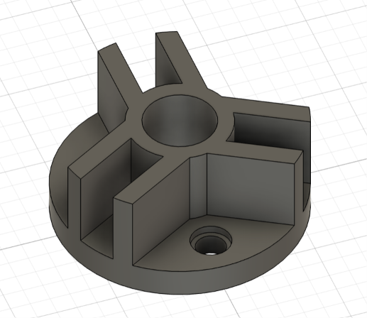
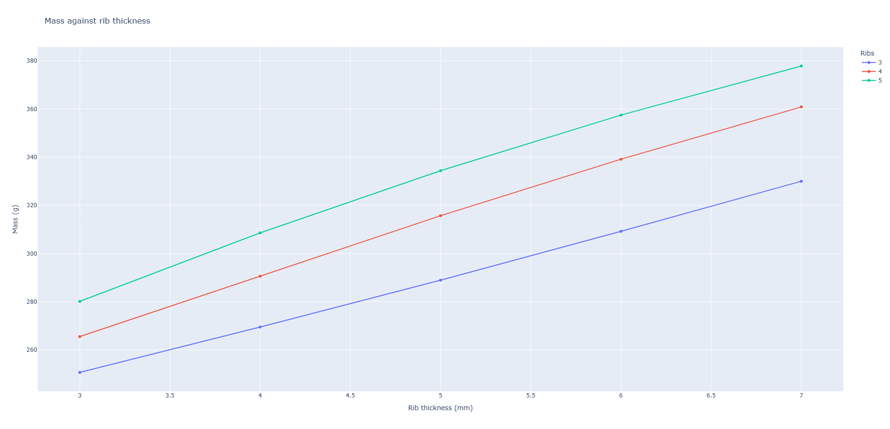
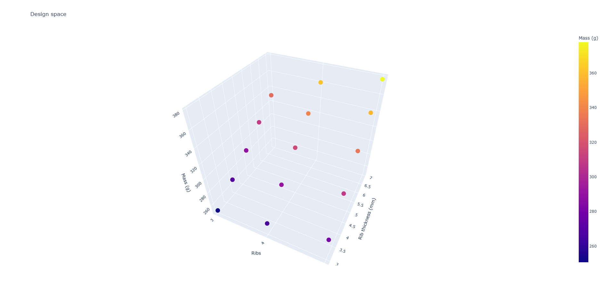
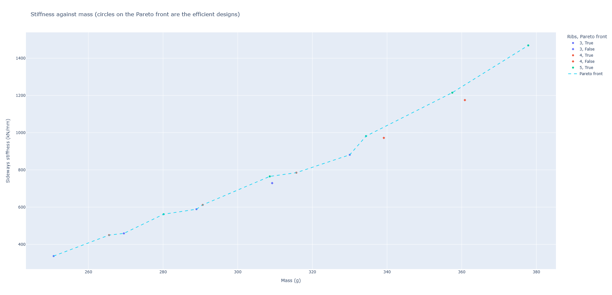
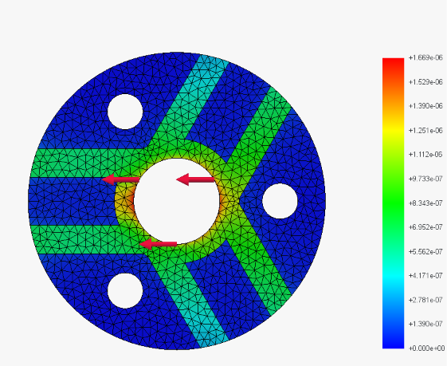
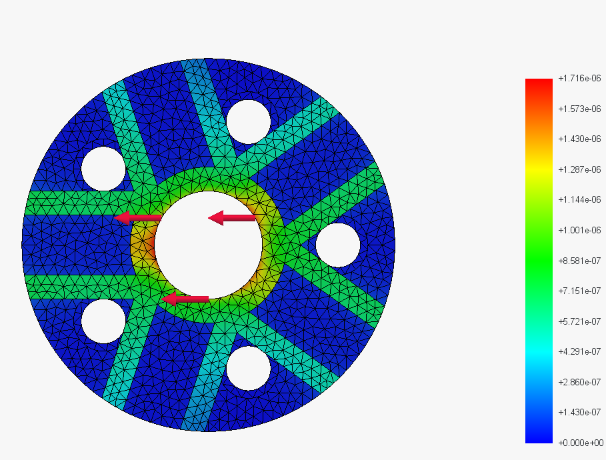

# Parametric Rib Study: Automated Design Exploration in Fusion 360

A small generative design pipeline. A parametric mounting hub is driven from Python through the Fusion 360 API, 15 design variants are generated automatically, and each is evaluated for mass and sideways stiffness. The quick stiffness estimate is then checked against finite element analysis in FreeCAD, which shows where the estimate holds up and where it breaks down.

<p align="center">
  
</p>

## The question

The part is a hub bolted down through its base, with a shaft through the central bore. When the shaft is pushed sideways, the ribs stop the hub from bending over.

**For a given mass, how should the ribs be arranged to make the hub as stiff as possible? Fewer thick ribs, or more thin ones?**

## Pipeline

1. **Parametric model (Fusion 360).** Every key dimension is a named User Parameter, so changing one value rebuilds the whole part.
2. **Variant generation (Python, Fusion API).** A script loops through every combination of rib count and wall thickness, rebuilds the model, checks every feature rebuilt successfully, and records mass, volume and surface area to CSV.
3. **Stiffness estimate (Python).** Each rib wall is treated as a cantilever beam, with its contribution weighted by its orientation to the load.
4. **Trade off analysis (pandas, Plotly).** Stiffness is plotted against mass and the Pareto front is identified.
5. **FEA validation (FreeCAD, CalculiX).** Two designs of near identical mass are simulated to test the estimate's ranking.

## The parametric model

The base geometry follows a Fusion 360 tutorial part. The work in this project is in making it robustly parametric and building the study around it.

The tutorial version could not change its rib count, because the ribs were drawn and trimmed as sketch lines. I rebuilt it so that a single rib is a solid feature, and the slots and bolt holes are patterned features, all driven by `rib_count`. The bolt holes are positioned at an angle of `180 deg / rib_count`, so they stay centred between the ribs for any rib count.

| Parameter | Baseline | Role |
|---|---|---|
| `rib_count` | 3 | Number of ribs, slots and bolt holes |
| `rib_thickness` | 5 mm | Thickness of each rib wall |
| `slot_width` | 10 mm | Gap between the two walls of a rib |
| `rib_height` | 20 mm | Height of ribs and hub above the base |
| `base_diameter` | 62 mm | Outer diameter of the base |
| `hub_diameter` | 26 mm | Diameter of the central hub |

Rib width is `slot_width + 2 * rib_thickness`, and the slot depth is linked to `rib_height`.

Fillets and chamfers were excluded from the study. Their edges change with rib count (with three ribs a thin strip of hub separates adjacent walls, with four or more the walls meet directly), so they cannot follow the pattern reliably. Their effect on mass is negligible.

## Variant study

15 variants: `rib_count` of 3, 4 and 5, and `rib_thickness` of 3 to 7 mm. All 15 rebuilt without errors.

<p align="center">
  
</p>

Mass rises linearly with wall thickness. The step from 4 to 5 ribs adds less mass than the step from 3 to 4, because ribs overlap more near the hub as they crowd together, and overlapping material only counts once.

<p align="center">
  
</p>

Each dot is one generated design, positioned by its rib count, wall thickness and mass.

## Stiffness against mass

<p align="center">
  
</p>

Twelve of the fifteen designs sit on the Pareto front. The three that do not are each beaten by a design with more, thinner ribs:

| Dominated design | Beaten by |
|---|---|
| 3 ribs, 6 mm | 5 ribs, 4 mm |
| 4 ribs, 6 mm | 5 ribs, 5 mm |
| 4 ribs, 7 mm | 5 ribs, 6 mm |

On this estimate, more thin ribs look more efficient than fewer thick ones. But the estimate makes two simplifying assumptions: it ignores shear deformation, and it treats every wall as the full 18 mm long, even though walls overlap more at the hub as the rib count rises. So I tested the ranking with FEA.

## FEA validation

The two designs compared, 3 ribs at 6 mm and 5 ribs at 4 mm, have almost identical mass, and the estimate said the 5 rib design was stiffer. Both were simulated in FreeCAD with CalculiX under identical conditions: base fixed, 1000 N applied sideways on the bore, steel, 2 mm mesh.

| Design | Mass | Estimated stiffness | FEA stiffness | Estimate error | FEA max stress |
|---|---|---|---|---|---|
| 3 ribs, 6 mm | 309.2 g | 729 kN/mm | 599 kN/mm | +21.7% | 106 MPa |
| 5 ribs, 4 mm | 308.6 g | 765 kN/mm | 581 kN/mm | +31.6% | 98 MPa |

<p align="center">
  
  
</p>
<p align="center"><em>Displacement under a 1000 N sideways load, on the same colour scale. Left: 3 ribs, 6 mm. Right: 5 ribs, 4 mm.</em></p>

## Findings

1. **The estimate got the stiffness ranking wrong.** It predicted the 5 rib design would be about 5% stiffer. FEA shows the 3 rib design is about 3% stiffer.
2. **The error grows with rib count** (22% for 3 ribs, 32% for 5), consistent with the estimate over crediting ribs that overlap at the hub.
3. **More ribs still reduce peak stress**, by about 8%, because the load is shared across more walls.
4. **At equal mass, the two layouts are close to equivalent in stiffness.** The choice depends on whether stiffness or strength governs the design.

The beam estimate is useful for fast screening across many variants, but its ranking needs checking with simulation before a design decision is made. This is the same logic as surrogate modelling: a fast approximation, validated against a slower, more accurate method.

## Limitations

- **Maximum stress is approximate.** It occurs at sharp internal corners, where FEA stresses depend on mesh size, because fillets were excluded.
- **Measured displacement includes local deformation** of the bore wall where the load is applied, which slightly understates overall hub stiffness. Both designs share this effect, so the comparison remains fair.
- **Only two designs were simulated.** The FEA checks the key ranking, not the full design space.

## Next steps

- Automate the FEA through FreeCAD's Python API, so every variant gets simulated stiffness rather than an estimate.
- Train a surrogate model on the simulated results to predict stiffness from the parameters.
- Add further parameters, such as rib height, to explore a larger design space.

## Repository structure

```
fusion_scripts/
    variant_test.py       First test: change rib_count and read mass
    variant_study.py      Generates all 15 variants and saves results
analysis/
    plot_results.py       Mass charts
    add_stiffness.py      Stiffness estimate and Pareto front
    fea_validation.py     Compares estimate with FEA
data/
    variant_results.csv
    variant_results_with_stiffness.csv
    fea_validation.csv
fea/
    ribs3_t6.step, ribs3_t6.FCStd
    ribs5_t4.step, ribs5_t4.FCStd
images/
```

## How to run

1. **Variant study:** open the parametric design in Fusion 360, then run `variant_study.py` from Utilities, Add-Ins, Scripts and Add-Ins. Results are saved as `variant_results.csv`.
2. **Analysis:** install the dependencies with `pip install pandas plotly numpy`, then run the scripts in `analysis/` in order.
3. **FEA:** open the `.FCStd` files in FreeCAD 1.x with the FEM workbench.

## Tools

Fusion 360 and its Python API, Python (pandas, NumPy, Plotly), FreeCAD FEM with CalculiX and Gmsh.

*Fiona Topore*
